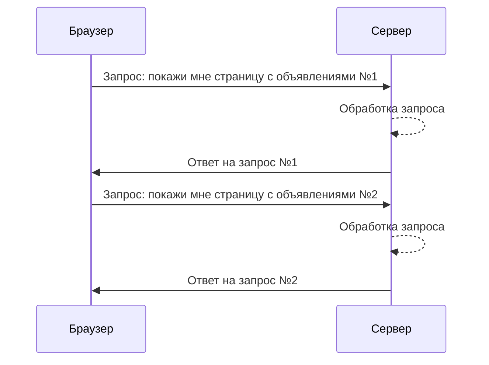
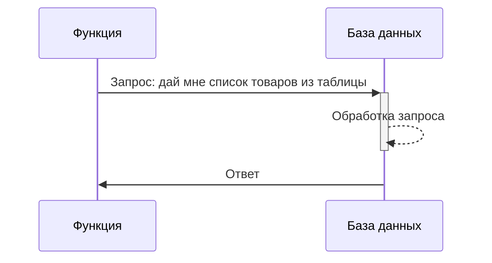
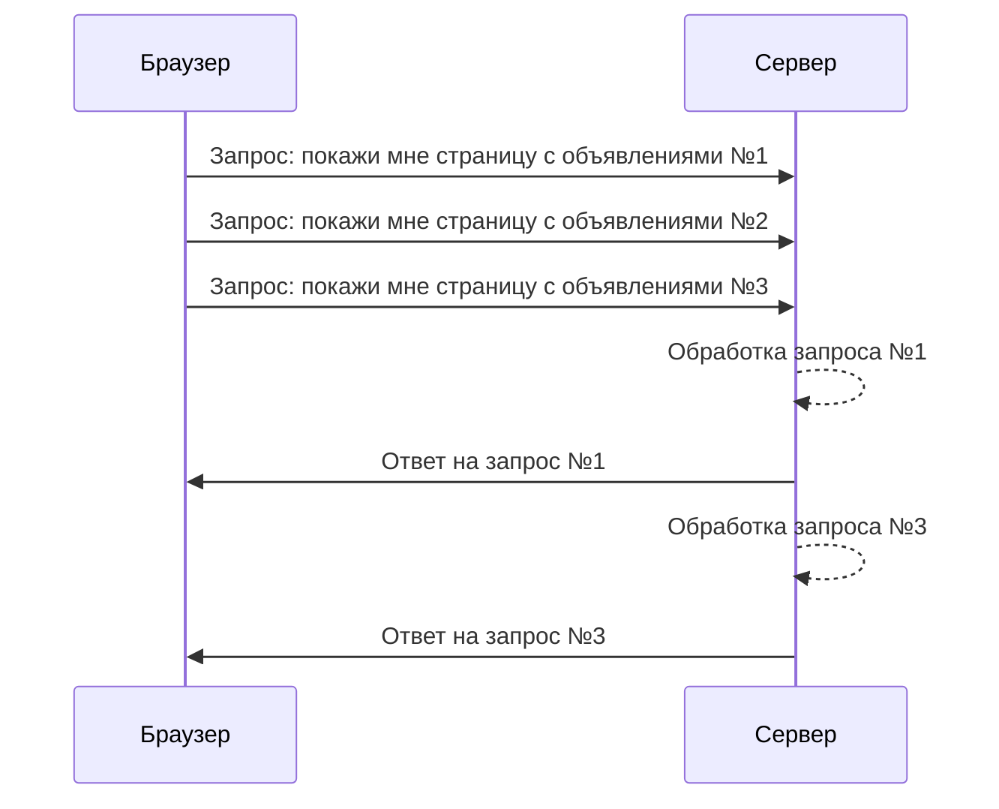

## Асинхронное программирование на Python

---

### Асинхронность

Существуют задачи, которые связаны с вводом-выводом, иногда
такие задачи останавливают(блокируют) выполнение остального кода программы.

<v-click>ввод-вывод:</v-click>

<v-clicks>

- работа с БД
- работа с сетью
- работа с файлами 

</v-clicks>

---
layout: center
---

```python
import requests
from time import perf_counter

URL = 'https://www.mashina.kg/search/all/?page='
start = perf_counter()
for i in range(1, 11):
    response = requests.get(URL + str(i))
    print("Page: ", i, "Status: ", response.status_code)

print("Time: ", perf_counter() - start)
```


---
layout: center
---

### Асинхронность



вместо браузера можно поставить скрипт, который делает запрос

---
layout: center
---

### Асинхронность



---
layout: center
---

### Минусы:

<v-clicks>

- обработка запроса(на сервере или в БД) может занять неопределенное время
- во время ожидания ответа наша программа просто ничего не делает

</v-clicks>

### Как можно исправить? 

<v-clicks>

- сделать код асиннхронным
- тогда не придется ожидать ответа на запрос, а отправить следующий

</v-clicks>

---
layout: center
---




---
layout: center
---

```python
import asyncio
from time import perf_counter
import httpx

URL = 'https://www.mashina.kg/search/all/?page='

async def get_page(url: str, client: httpx.AsyncClient) -> tuple[int, str]:
    response = await client.get(url)
    return response.status_code, url

async def pack_request_tasks():
    async with httpx.AsyncClient() as client:
        tasks = []
        for i in range(1, 11):
            tasks.append(
                asyncio.create_task(
                    get_page(URL + str(i), client)
                )
            )
        
        results = await asyncio.gather(*tasks)
        for status_code, url in results:
            print("Page: ", url, "Status: ", status_code)

if __name__ == '__main__':
    start = perf_counter()
    asyncio.run(pack_request_tasks())
    print("Time: ", perf_counter() - start)
```

---
layout: center
---

### Асинхронность

<v-clicks>

- Запросы запускаются асинхронно, внутри корутины(асинхронной функции) т.е. не блокируется выполнение программы во время ожидания результата
- единый клент(`httpx.AsyncClient as client`) для лучшей производительности и переиспользованию соединений
- `asyncio.create_task` - создает задачу из корутины, таким образом корутина автоматически планируется для выполнения
- `asyncio.gather` - позволяет выполнить несколько корутин и дождаться их завершения перед возвратом их результатов
    - если какая-то корутина выдала ошибку, то остальные корутины не будут выполнены


</v-clicks>
